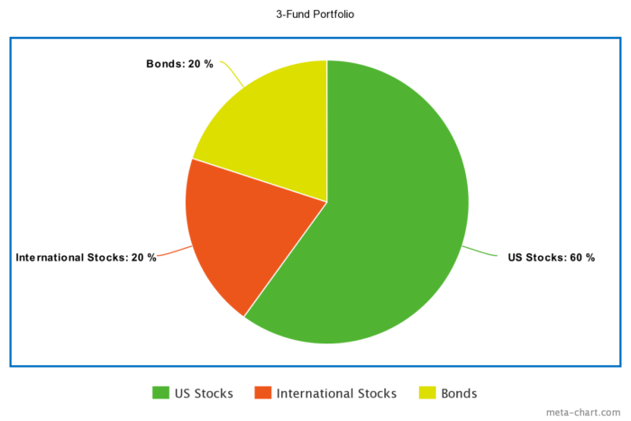An example of asset allocation. As much as I loathe pie charts, here you go. 

## Includes beginner, moderate, and advanced strategies

Imagine you are investing $1 million for your financial freedom.

Sure, you *could* put it all in your Uncle's inflatable dartboard business...

... or a large, well-known company like Google or Amazon...

... but those are risky. 

What happens if they unexpectedly plummet? Where will you be then?

So rather than buy just one stock, you decide to buy lots of stocks in the US...

... but what happens when the US stock market crashes? So you decide to buy stocks in China, too...

... but what if those stocks go down, too? And what if the US dollar collapses... or China enters a trade war... or... or... or...

...

...

...

Relax. 

Understand that risk is everywhere, and that, while you can't eliminate it, you can reduce it by purchasing different assets—such as stocks, bonds, and real estate—through *asset allocation*.

Asset allocation can be as simple or complex as you wish. A simple, hands-off asset allocation can be set up in less than ten minutes; a more robust allocation that considers tax-efficiency and rebalancing can take days, or even weeks, of research and ongoing adjustments. 

Where you stand in this spectrum doesn't matter. What matters is that you take action.

- If you want to just get an allocation set up and never look at it again, [skip to this section](#simple). Then go outside and play.
- If you want to see how deep the rabbit hole goes—including the benefits of asset allocation, the seven risks to watch out for, and how to structure a tax-optimized portfolio that delivers the best possible risk-adjusted return—then keep reading.

This is a long article. I've included links to each section below so you can skip ahead if you want. 

## Here's what you'll get on this page:

- [Asset allocation: why you need it](#what-asset-allocation-is)
- [Understand your risk tolerance](#risk-tolerance)
- [The 7 different types of risk—and how to reduce them](#types-of-investment-risk)
- [A full list of asset classes to invest in](#types-of-assets-to-buy)
- [Choosing your allocation (with examples of simple, moderate, and advanced approaches)](#asset-allocation-examples)
- [How taxes affect your investment options](#how-taxes-affect-allocation)
- [Rebalance your allocation—a few ways to do it right](#rebalance-allocation)

## Asset allocation: why you need it

Francis Bacon said:

*"Money is like manure, it's only good if you spread it around." *

When you spread your money around, good things happen. You reduce your risk; you increase your returns. Your investments are not tied to any single company (or country, or asset class) which means your wealth is not subject to one catastrophe. You sleep better.

In a nutshell, choosing your asset allocation is a three-step process:

1. Understand your level of effort, risk tolerance, and time frames
2. Choose an allocation that fits and rebalance accordingly
3. Optimize for taxes

It really is that simple. 

Buy different assets—lots of 'em—and watch them grow. Sure, some will lose value in the short-term. But others will gain value. And, over time, most—if not all—of your assets will go up. 

This approach is called *diversification*. When you invest in lots of different* *asset classes—such as stocks, bonds, commodities, and real estate—you diversify your investments, spread out your risk, and smooth the ride to financial freedom.

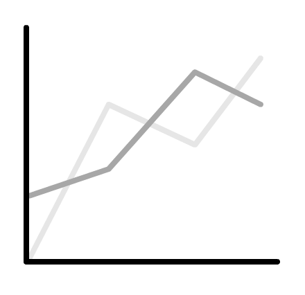As one asset goes up, the other goes down. This reduces overall volatility.

It's a fact: diversification boosts returns and reduces risk.

But what is "risk" anyway? You may have heard people say "Oh, stocks are risky..." or "real estate is risky..." or "unprotected sex with strangers is risky..."

OK, I'll give them that last one. 

But the point is: buying uncorrelated assets reduces your exposure to all types of risk—as we'll see below.

**Key point:** Asset allocation allows you to diversify your investment and reduces all types of risk.

## Understand your risk tolerance

Every investment is risky:

- Your cash erodes away due to inflation.
- Your currency loses its buying power thanks to stupid government policies.
- Your planet is hit by an asteroid.

Therefore, **you cannot avoid risk; you can only minimize it**. And by diversifying, you reduce the risk of One Major Shitty Event wiping your wealth off the map.

Here's a funny thing about risk and portfolios: the safest portfolios often contain risky assets—while the riskiest portfolios often contain the "safest" assets.

Most people confuse "risk" with volatility—and that's dangerous. Just because an asset moves around a lot doesn't make it a risky bet. 

Yet volatility is how we're trained to think about risk. As Michael Lewis wrote in The Big Short:

*“(Michael Burry) argued that the way they measured risk was completely idiotic. They measured risk by volatility: how much a stock or bond happened to have jumped around in the past few years. Real risk was not volatility; real risk was stupid investment decisions.” *  

Here's an example of a stupid decision that isn't volatile: I can sit in a boat that is slowly sinking. It is it volatile? No. Is it risky? Hell yes!

The same goes for assets. Just because an asset is volatile doesn't make it risky, and vice versa.

Before we look at assets, however, we need to identify the risks. 

## The 7 types of risk—and how to reduce them

### Risk 1: Inflation risk (or purchasing power risk)

**What it is:**  

*Inflation risk* is like heart disease: it's a silent killer. Your currency grows less valuable over time, and fails to keep up with the growth of your assets.

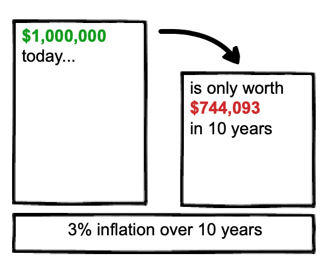Inflation erodes your wealth over time.

The cruel irony of inflation risk is that it's most likely to happen to the risk-averse; in other words, by trying to avoid risky investments, people overcompensate and fail to achieve the needed returns to fund their expenses.

On one hand, this seems like a good problem to have: you live longer than you expect. On the other, it's a lousy problem: you're old, unemployed, and broke.

**How to reduce it:** 

Buy stocks to provide long-term growth. If you follow the advice in this course, you'll likely "retire" far earlier than the average person—which is great. But a 50+ year retirement means taking the long view. You need the growth that only equities provides; otherwise, your investments will erode due to your withdrawing and inflation. In short: invest in stocks for the long-term; you'll be glad you did.

### Risk 2: Currency risk (i.e. foreign-exchange risk)

**What it is: **

*Currency risk* is when you invest in another country and their currency fluctuations affect your return.  Even if your investment grows in value, currency risk can erode your profits—and turn a winner into a loser.

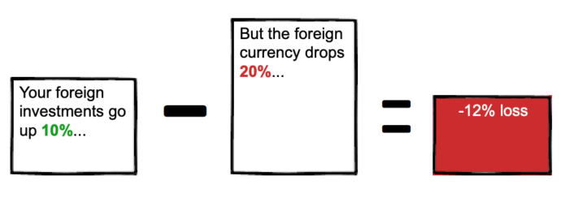Currency risk can turn a winning investment into a loser. (Note: we see a 12% loss here since the 20% drop happened after the 10% gain. For example, $100 invested would grow to $110, then drop to $88. 110-(110*.20) = $88, a 12% drop from 100.

Note that currency risk applies whether you invest internationally or not: if you live in the US, and the US dollar plummets, your buying power internationally declines, too.

**How to reduce it:** 

Invest in countries with strong currencies. In addition, buy currency forwards, currency futures, gold (and other precious metals), currency-hedged funds, and crypto assets. 

### Risk 3: Political risk

**What it is:** 

*Political risk* is when instability leads to unforeseen changes in either in a country or region—which leads to negative returns. The effects of political risk grow more pronounced in the long-term. Why? Because seemingly small political decision today can compound into a large problem in the future.

**How to reduce it:** 

Invest in lots of different countries and regions around the world. Avoid overweighting your investments in a single region (such as Europe) or country (such as the US). Lastly, realize that since political risk increases with a longer timeframe, consider short to mid-term investments if you're worried about political risk. (Or better yet, don't invest in it at all.)  

### Risk 4: Credit risk

**What it is:** 

Also known as *default risk*, *credit risk* is the risk of you lending money to someone—whether a person, a company, or country—and never getting your money back. 

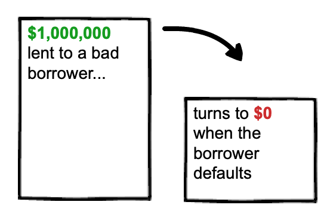Credit risk has serious downside. 

Credit risk is especially concerning for bondholders. If you hold bonds, you are, in effect, lending money to companies or countries, who pay you interest in return. If that company or country defaults, you don't get paid. 

**How to reduce it:** Avoid over-investing in bonds. If you do invest in bonds, stick to government bonds and investment-grade corporate bonds.   

### Risk 5: Country risk 

**What it is:** 

*Country risk* is when a country defaults on its obligations. This can be due to political instability (also known as political risk) or, say, being invaded. 

Country risk applies to all investments in a given country, including stocks, bonds, and futures.  

Note that every country has a different level of risk. For example, Sweden has less risk than South Sudan.

**How to reduce it:** 

Invest in multiple countries and regions. Sure, you could just invest in US companies, but you may get better returns and less risk by investing in multiple countries and regions.   

### Risk 6: Interest rate risk

**What it is:**

*Interest rate risk* is when changes in the going interest rate negatively affect your investments. For example, when interest rates rise, bond prices fall. When interest rates fall, bond prices increase. 

Interest rate risk mostly applies to bonds, particularly longer-term bonds. This makes sense: if you take a 30-year loan, the difference in interest rate can be huge over such a long timeframe. 

Here's another example: you invest $10,000 in a 30-year bond at 3%.  Therefore, you can readily expect $300 a year in payments. But then interest rates go up to 4%—which means that anyone now buying bonds will get $400 a year in payments, while you only get $300. In this example, the difference of $100 a year is equal to a 33% opportunity cost. 

Interest rate risk also applies to stocks. As interest rates increase, a company's cost to borrow goes up. Since borrowing is now more expensive, the company may not borrow more money, money which could be invested to spur further growth; this can result in lower furture earnings for the company—and lower stock prices and dividends for you.

**How to reduce it:** 

Invest in sectors that perform well when interest rates increase. Historically, the financial sector—including banks, insurance companies, and money managers—have performed the best, due to higher profit margins. 

Another option is to buy a *cap* (or *call option*) on a given interest rate. If interest rates rise to an agreed upon level—called a *strike price*—then you get paid. Buying a cap is a nice hedge to your investments exposed to interest rate risk.  

### Risk 7: Liquidity risk

**What it is:** 

*Liquidity risk* is when you cannot buy—or more commonly, sell—investments quickly and for a fair price. Stocks are easy to sell; houses and businesses aren't, and therefore contain liquidity risk.

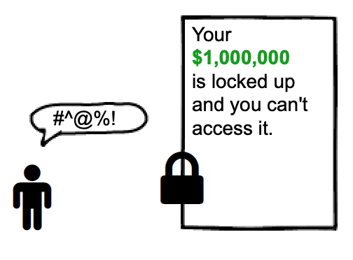Liquidity risk doesn't necessarily mean you lose money—but you lose the opportunity to sell the asset quickly.

**How to reduce it:** 

Don't tie up large amounts of capital in assets that suffer liquidity risk. If 90% of your net worth is your home, consider refinancing to pull out that equity and invest in elsewhere. (Or just start saving and investing more into other asset classes, as explained below.)

**Key point:** all seven types of risk can be summarized in one risk: the risk of outliving your money. 

## The types of assets to invest in

OK, now that we've looked at the seven types of risk—inflation, currency, political, credit, country, interest rate, and liquidity risk—we can safely turn toward which assets to buy.

Why? Because different assets counter different risks. Like a doctor noting symptoms and prescribing treatment, we look at our risk and prescribe assets to minimize them.

There are three main asset classes: *stocks*, *bonds*, and *cash reserves*. Most people will have at least these three. 

In addition, there are three other asset classes: *real estate*, *commodities* (such as oil, precious metals, pork bellies) and, increasingly, *crypto assets*. 

Let's start with the most important: stocks.

### Asset 1: Stocks for the long-term

Equities, or stocks, mean you buy interests in companies. Over time, these companies grow and their share price goes up. They also may produce dividends, which provide income. You can either take the dividends and put them into your pocket, or automatically reinvest them to buy more shares. (I recommend reinvesting all dividends because it compounds over time, which significantly grows your wealth.)

Stocks aren't all the same, though. You can further break them down into smaller sub-classes by size (smallcap, midcap, and largecap), location (domestic or international) and strategy (value vs. growth).

Let's look at each:

**By size.** Stocks are segmented by their market capitalization, also called their "market cap." 

- *Small-cap* (between $250 million and $2 billion)
- *Mid-cap* (between $2 billion and $10 billion)
- *Large-cap* (over $10 billion)

**By location. **This is pretty straightforward, as you can see below. 

- *Domestic* (stocks in your home country)
- *International* (stocks in other countries)
- *Region-specific* (e.g. Europe, Asia)

**By investment style.** Stocks can be broken down into two styles: *growth* and *value*.

- *Growth stocks* are companies that are expected to grow faster than average. Because of this focus on growth, these companies reinvest their profits to fuel further growth—such as hiring new people, purchasing new equipment, and acquiring other companies—which means you shouldn't expect dividends. 
- *Value stocks*, on the other hand, aren't expected to grow as much, or as fast, as growth stocks. Because of this, they tend to trade for lower prices than growth stocks. Another benefit is that value stocks tend to pay higher dividends—which means you can continue to get paid just for owning the stock, even if the price doesn't budge.

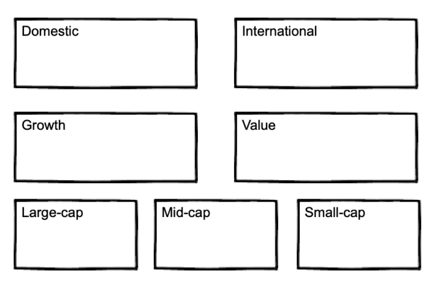

As you can see, there are lots of different ways to slice up stocks. You can choose just one (like "small-cap") or mix-and-match (like "small-cap, international value"). 

Here are two examples:

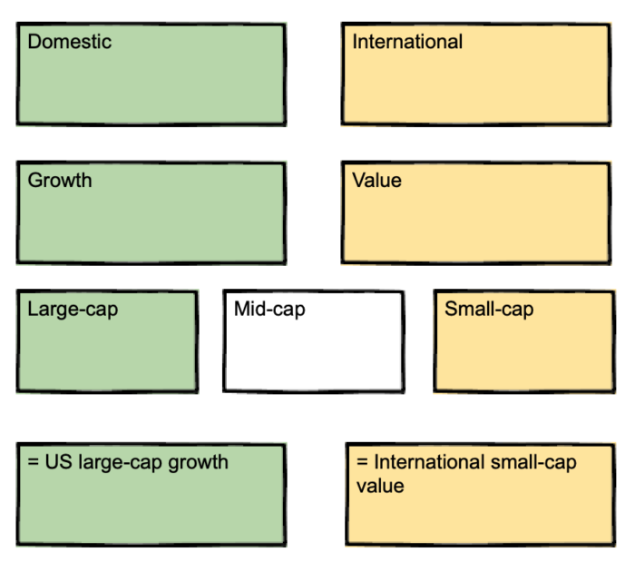In these two examples, you select funds by location, investment style (growth or value) and market-cap size.

So which stocks are best? 

We'll get to that in the example allocations below. For now, rest assured that it won't be complicated; you can easily invest in all of the above with a few simple index funds. 

### Asset 2: Bonds to smooth the ride

During a stock market crash, bonds reduce volatility and limit your losses.

But not all bonds are the same. 

- Many, such as *government bonds*, are issued by the federal government and therefore carry the least amount of default risk. (Whether this will be true down the road is anyone's guess.) 
- Others, such as *corporate bonds* (i.e. bonds from companies), tend to have higher default risk; in exchange for this risk, they pay higher interest rates. 

Corporate bonds fall into two categories: *investment-grade* and *junk*. 

*Investment-grade bonds*, as you can probably guess, are considered more solvent and less likely to default, while *junk bonds* carry a higher credit risk—and therefore, higher interest rates. If you're interested in seeing the ratings for each bond, check out Standard and Poor’s bond ratings. It's delightful reading.

There are two reasons to hold bonds in your portfolio: one financial, one psychological.

1. The **financial** reason: To create a bond tent, which reduces sequence of returns risk when you eventually retire.
2. The **psychological** reason: To provide peace of mind if you cannot handle the volatility of 100% equities.

If you're still years from retirement, the first point is moot.

The second point is more psychological than financial. Over a long enough time frame, 100% stocks should outperform a blend of stocks and bonds—but the road will be rockier, and paved with the blood of cowardly investors who sold for a loss. If owning bonds helps you stay in the market and sleep well at night, go for it. Just don't go overboard: you need stocks to grow; otherwise, you'll outlive your money!

### Asset 3: Cash for emergencies

Save up 3–6 expenses in case of emergencies. But no more. Remember that inflation, like heart disease, is a silent killer. It eats away at cash, so don't leave too much money exposed. 

Shit happens. Be prepared. 

Besides the "Big 3"—stocks, bonds, and cash—you may want to further diversify into the following asset classes:

- Real estate
- Commodities
- Crypto assets 

### Asset 4: Real estate or REITs

*Real estate* takes many forms. It could be owning your own home, rental properties (either residential or commercial), or investing in *Real Estate Investment Trusts*, also known as *REITs*. With the exception of your own home, real estate generally pay dividends and acts as a hedge against inflation (since real estate historically rise along with inflation).

If a large part of your net worth is tied up in your home, you've a few options. On one hand, you may not want to invest in REITs. But from an income perspective, it would make sense: if you're looking to retire sooner and live on your investment income, REITs will obviously provide a better income stream than equity trapped in your home.

If you don't own your own home or other real estate, owning small percentage of REITs can be a good idea. (Though this depends on your tax situation, which we get to a bit later.)

### Asset 5: Commodities and precious metals

*Commodities* are actual things. Unlike nearly everything else in this list, which are just paper. Commodities include tangible goodies—like oil, natural gas, wheat, and corn—and precious metals like gold, silver, and platinum.

Precious metals hedge against three risks. 

- Against currency risk. 
- Against liquidity risk. Because they have an agreed upon value, you can quickly exchange precious metals for cash.
- Against credit risk. credit risk like bonds (which require someone to lend to; you don't need to loan money to gold)

### Asset 6: Crypto assets

*Crypto assets* are the new kid on the block. They are considered digital money, but to be honest, that greatly underestimates their value. It is an independent asset class that is uncorrelated with stocks and bonds. This alone makes it a good asset class to purchase.

The financial planner and Wall Street advisor Ric Edelman explains his views on crypto assets in this video:

https://www.youtube.com/watch?v=pMKkM3qpA7k

## Example allocations to get you started

### Simple

Want simple? I mean brain-dead, set-and-forget *for decades* simple? Then this is the approach for you.

Introducing: Vanguard LifeStrategy Funds.

From Vanguard:

- *Less risk through broader diversification. Each fund invests in Vanguard's broadest index funds, giving you access to thousands of U.S. and international stocks and bonds, including exposure to the major market sectors and segments.*
- * Automatic rebalancing. Each fund is professionally managed to maintain its specific asset allocation, freeing you from the hassle of ongoing rebalancing.*
- * Low costs. The average Vanguard LifeStrategy fund expense ratio is 80% less than the industry average.**

I prefer the LifeStrategy Growth Fund because it has a higher stock allocation—which is needed if you're looking to draw on your investments for 30+ years. (If that seems too extreme, you can also use the LifeStrategy Moderate Growth Fund, which has a higher bond allocation, but still a majority in stocks.)

You can [see all the LifeStrategy funds here](https://investor.vanguard.com/mutual-funds/lifestrategy/#/). To get started, simply select the right fund for you, based on your timeframes and risk tolerance. Once you've created the Vanguard will automatically rebalance the portfolio for you, so you never need to even look at this account again if you don't want to.

The tradeoff?

LifeStrategy funds are not as tax-efficient as doing it yourself. Why? Because it contains a large amount of holdings in bonds—which produce a lot of dividends that will be taxed—and which may end up in your taxable account. This point is moot if you are investing in retirement accounts, however. We discuss the effects of taxes in the next section.

Who LifeStrategy funds are for:

- People who want the simplest solution, that's completely set-and-forget
- People in all tax-brackets (though people in higher tax brackets will benefit more from a do-it-yourself approach)
- Works in taxable and non-taxable accounts (though tax-sheltered accounts are preferred, particularly for the more conservative allocations)

**The above approach is really all you need.** Seriously. You can set up a LifeStrategy fund and go on your merry way. But if you're like me—someone interested in investing and looking to optimize it as much as possible—then keep reading. 

### Moderate

Here's what a moderate allocation looks like:

**What to invest in:**

- 60% Vanguard Total Stock Market Index Fund (VTSAX)
- 20% Vanguard Total International Stock Index Fund (VTIAX)
- 20% Vanguard Total Bond Market Fund (VBTLX) 

If you cannot handle the volatility of 80% stocks, you can bump up the bond allocation up to 30%:

- 55% Vanguard Total Stock Market Index Fund (VTSAX)
- 15% Vanguard Total International Stock Index Fund (VTIAX)
- 30% Vanguard Total Bond Market Fund (VBTLX) 

Regardless how you set up the allocation, this approach is more tax-efficient than simply buying a LifeStrategy fund from Vanguard.

**Who this is for:**

- People who want a simple allocation poised for growth, but are willing to spend a bit more time 
- People in all tax-brackets
- Works in taxable, non-taxable, and tax-managed accounts

### Advanced

As we've seen earlier, there are many other asset classes available. And each asset class can be broken down further into smaller sub-classes. For example: until now we've only separated asset classes by geography: US and international. 

But for each, there are smallcap, midcap, and largecap, growth and value. 

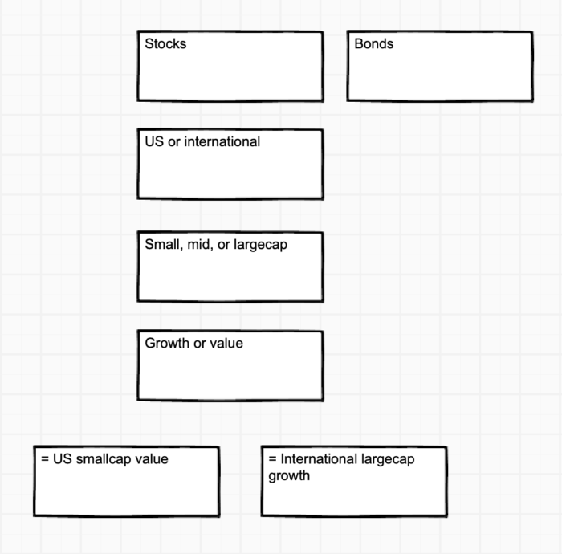

An example of an advanced portfolio: 

- 10% S&P 500 
- 10% U.S. small-cap stocks 
- 10% REITs 
- 10% international large-cap stocks 
- 10% international small-cap stocks 
- 10% emerging markets stocks 
- 10% precious metals stocks 
- 10% crypto assets
- 20% U.S. short-term bonds 

For the most part, this portfolio is split equally between domestic and foreign, and small and large cap. It also introduces three additional asset classes for greater diversification: real estate, precious metals, and crypto assets.

Because we've covered six different asset classes, we spread our risk, and reduce the overall risk to our portfolio. 

Every day, good and bad things will happen to your investments. For every time the real estate market crashes, or gold prices plummet, or several countries enter a trade war, there's a bull market elsewhere in the world.

Here's a funny thing about risk and portfolios: **the safest portfolios often contain risky assets**—while the riskiest portfolios often contain the "safest" assets. As you've learned, putting your cash under your mattress may seem risk-free, but in fact you guarantee that inflation will erode your investment away to nothing. 

Now that we've looked at several example allocations—including what asset classes to buy, and how much—let's look at which accounts each asset class belongs in. There is only one factor that matters: taxes.

## Taxes: how they affect your investment options

If there's one thing you take away from this section, make it this: **decide your asset allocation *****first*****, then consider the tax situation last.** Your allocation is, without a doubt, the most important part—so focus on that first.

In a nutshell, your options lie between two opposite extremes, which depends on whether your accounts are taxable or tax-sheltered.

- If all your investments are held in *tax-sheltered accounts*—which includes retirement accounts like a 401(k), traditional IRA, or pension plan—then it doesn't matter which investments your choose from a tax perspective. You can buy, hold, or sell these assets at any time, without any tax implications. 
- On the other hand, if all your investments are held in *taxable accounts*—which includes standard brokerage accounts—then you are limited to a handful of assets due to the tax inefficiencies of many asset classes. While this constraint may sound bad, there's an upside: this constraint keeps things simple, which allows you to quickly decide on your asset allocation and move on with your life.

The two scenarios listed above are the opposite ends of the spectrum. 

<tax-sheltered accounts>  --------- <taxable accounts>

And both are relatively straightforward. The real complexity, however, comes in when you have a combination of taxable and non-taxable assets. Chances are, you are in this situation.

If you are, invest your most tax-efficient assets in your taxable account, and your least tax-efficient assets in your tax-sheltered accounts.

The following image shows how this is done:

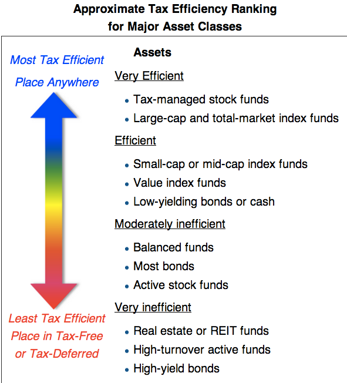Source: [Bogleheads.org](https://www.bogleheads.org/forum/viewtopic.php?t=256705)

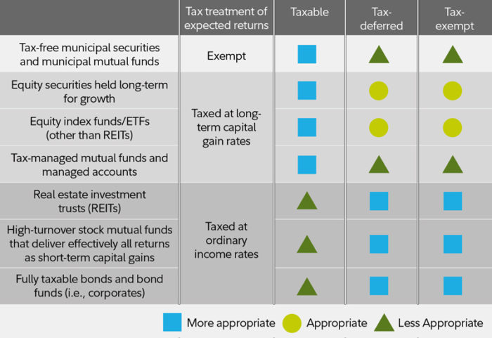

The image above shows the tax efficiency of asset classes. But it doesn't show which funds you should buy for each asset class.

Below, I've created a table that shows the relevant Vanguard funds that buy each of these asset classes (where applicable), and whether the asset should go in your taxable, tax-sheltered (i.e. retirement), or tax-managed accounts.

| **Asset** | **Taxable** | **Tax-sheltered** | **Tax-managed** |
| Total Bond Market Index (VBTLX) |  | x |  |
| Total International Bond Index (VTABX) |  | x |  |
| Total International Stock Index (VTIAX) | x |  |  |
| Total Stock Market Index (VTSAX) | x |  |  |
| Small-Cap Index (VSMAX) |  | x |  |
| Emerging Markets Stock Index (VEMAX) | x |  |  |
| Real Estate Index (VGSLX) |  | x |  |
| Crypto assets (Coinbase) | x |  |  |
|  |  |  |  |

Look at the table above. Place any funds in the "Tax-advantaged" in a retirement account such as an IRA or 401(k). 

Why? Because these investments produce most of their returns as dividends, which will be taxed annually; these taxes may seem innocuous at first, but they drag down your returns in the long run.

**Key point:**   All assets work in retirement accounts; some assets work in taxable accounts.

In general, the more money you can invest into retirement accounts, the greater variety you have in regards to assets.

### How to determine your tax-sheltered account limits

Use the following links to see the current limits for each tax-sheltered account:

- [Current 401(k) contribution limits](https://www.google.com/search?q=current+401k+contribution+limits&oq=current+401k+limits&aqs=chrome.3.69i57j0l4.8688j0j1&sourceid=chrome&ie=UTF-8)
- [Current IRA contribution limits](https://www.google.com/search?ei=lEBaXPuVDZL19AP_oaRg&q=current+ira+contribution+limits&oq=current+ira+contribution+limits&gs_l=psy-ab.1.0.0j0i8i30l2.49666.51607..53873...0.0..0.175.499.4j1......0....1..gws-wiz.......0i71j0i7i30j0i7i10i30.IWOrPtdc590)
- For the self-employed: [Current SEP IRA contribution limits](https://www.google.com/search?hl=en&authuser=0&ei=ykBaXNjwCLCj1fAP_cSOwAU&q=current+sep+ira+contribution+limits&oq=current+sep+ira+contribution+limits&gs_l=psy-ab.3...3699.3909..4305...0.0..0.186.513.1j3......0....1..gws-wiz.......0i71.jbGEYBNmpCM)

After reviewing the contribution limits, you determine you can invest $20,000 a year in your tax-sheltered accounts. 

That's pretty sweet. 

I recommend you read the [article on investment order](https://adam-costa.com/financial-freedom/automate-scale-your-investments/investment-order/) to learn more about this process.

## Rebalance your allocation—a few ways to do it right

Over time your investments allocation will drift from each other. This is natural. For example, if your US stocks soar, you'll go from 60% stocks to 90% stocks—which is way out of line from your original allocation. 

When your allocation gets out of whack—which it inevitably will—you sell some of your shares to purchase the ones there is less of. This is called *rebalancing*.

Rebalancing is amazing. Like improving your sleep, it solves so many problems, and delivers so many benefits, that you wished you'd acted on it sooner. 

Rebalancing trains you to "sell high, buy low." This is a mantra people cite, but rarely follow. Most people buy when everyone around them is buying, too—and therefore driving up the price—then sell when the market crashes. Rebalancing applies a Vulcan-esque logic to your investments in that you automatically sell assets that have performed well (and are therefore more expensive) to buy assets that haven't performed well (and are therefore cheap by comparison). As investment Ben Graham said: "buy stocks as they bought their groceries, not as they bought their perfume." In other words: buy quality goods on sale.

But when do you rebalance? And how?

The answer depends on whom you ask. 

Some folks recommend you rebalance once a year by selling off top-performing shares, and bringing your allocation back in line.

Others, like me, recommend a different approach. Rather than make large, sweeping changes in your portfolio—and possibly invoking the wrath of the tax man—you simply start buying more of the underperforming asset. 

There are several benefits to this approach, but here are the main ones:

First, it's simpler. Let's face it: selling one asset to buy another isn't difficult. It's like, maybe five extra minutes. But I find that every added step to a process increases the chance of not doing it. 

Second, it's more tax-efficient. Selling assets for a gain can lead to taxes if your assets are held in a taxable account. If your assets are in a retirement account (you lucky dog) there are no considerations and you can do whatever the hell you want. Good for you.

In fact, you could make a strong argument to never rebalance in your taxable account. (The federal and state taxes on capital gains are a pain and reduces your compound growth—an even bigger pain.)

## Summary: the checklist to follow

- Determine your allocation
- Set it up 
- Set up auto-invest
- Forget about it