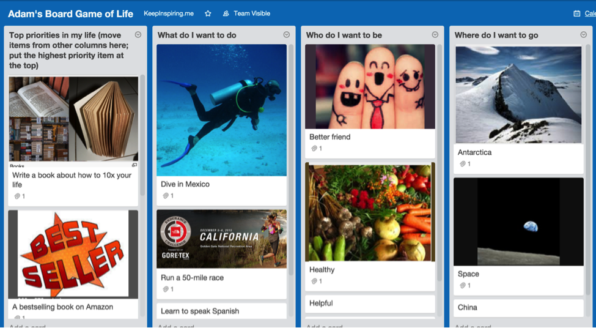
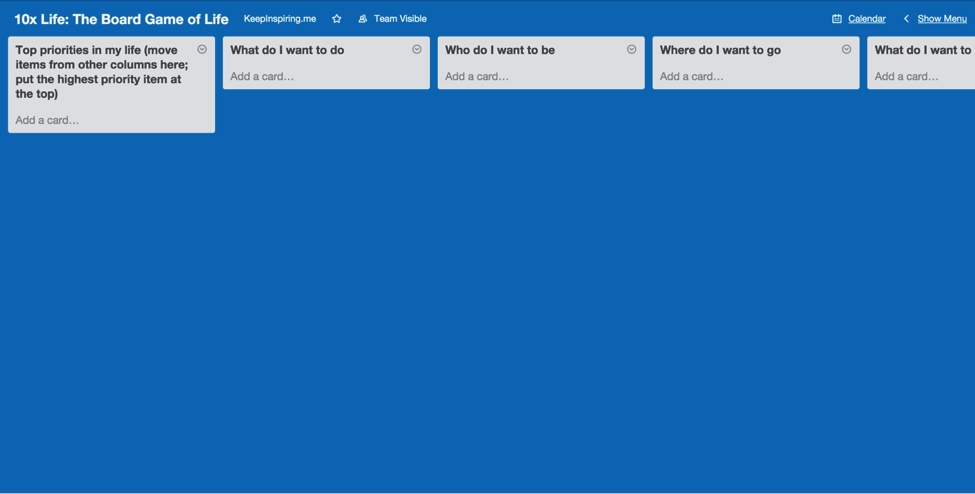
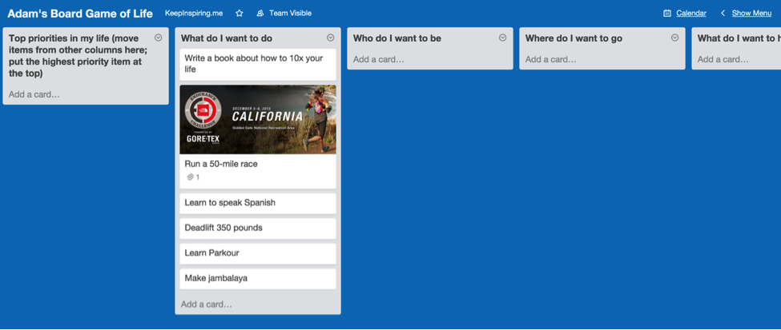
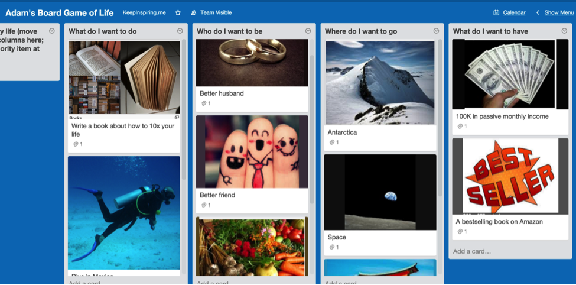
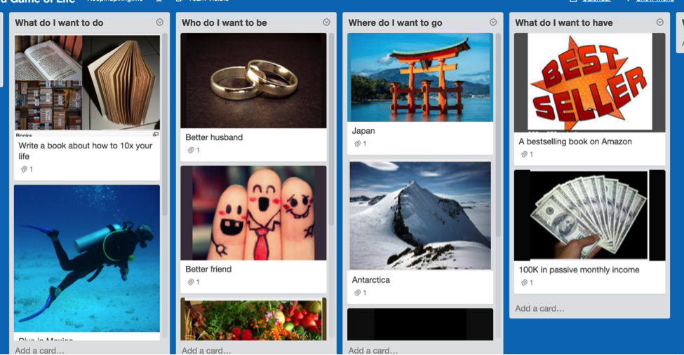

You'll build this by the end of this chapter.

## How to map out your dreams, turn your life into a game, and gain a crystal-clear vision of what you want in life

| **“*As you enter positions of trust and power, dream a little before you think.*” **

 

—Toni Morrison, American Novelist, and Professor
 |

Let me be frank: this chapter will be the most fun you could have with your clothes on.

You’ll discover:

- The EXACT questions that reveal your true desires.
- A simple process to map out your entire life, including your dreams, goals, and bottlenecks.
- A free tool you can use right away to keep yourself accountable.

Ready to roll? 

## Why you MUST write down your goals

| **Goal**: the object of a person's ambition or effort; an aim or desired result. |

Fifteen years ago, I’d (barely) graduated from college, and went to Yosemite for the summer to work as a cook—and to figure out what the hell to do with my life.

You see, I’d “invested” four glorious, debaucherous years in college and had no idea what to do next. Sure, I had an idea about what I *wanted* to do, but that didn’t fit in with the whole “Purpose in Life” thing.

Oddly, though, the answer was waiting for me. Filed away. In my dad’s closet.

Here’s what happened: After my summer gig in Yosemite, I returned home, and my dad asked me to help him move.

And if there’s one universal truism, it’s this: When you have a massive hangover, someone will ask you to help them move. I have no idea why, but it’s true.

So, naturally, I woke up that morning with a hangover the size of Texas. A temple-throbbing, gut-wrenching, *oh-I-wish-the-lord-would-take-me-now* hangover.

I didn’t want to help him move. But I’m a good son (even if I’m a crappy mover). So there I was, helping my dad move piles of storage boxes into his new apartment.

While shuffling through stuff in his closet, I saw it: the box that contained all my worldly possessions. After school, I had sold, burned, or thrown away everything I owned except for a few choice items; I dumped these items, haphazardly, into a medium-sized cardboard box, sealed it shut, and promptly forgot all about it for the past four months.

In that box was the usual memorabilia: postcards from friends, newspaper clippings, essays I’d written, etc.

**But one item stood out:** a single sheet of paper, featuring a drawing with three long, spindly trees.

The trees were labeled: *personal*, *financial*, and *travel*. Each tree had several branches, and each branch listed something I wanted to do, like, “Hike in Nepal,” “Become a cook,” and “Live in Yosemite.”

Here’s the astonishing thing: I wrote that list four years ago, and—even though I’d completely forgotten about it—**I’d done nearly everything on that list**.

In the words of Keanu Reeves: *Whoa*.

So what the hell happened? How did I—a guy who can barely remember where he put his underpants—manage to *retain* this information, and *act* on it, over several years? What sort of devilry was at work here?

The answer is obvious. By writing down my goals, I:

- *consciously* defined what I wanted to do, and
- *sub-consciously* acted in accordance with them.

You see, it’s all about…

## The science behind goal setting

There are two scientifically proven reasons to set your goals.

**First, setting goals increases motivation.** A 1967 [study](http://psycnet.apa.org/psycinfo/1967-09780-001) published in the *Journal of Applied Psychology* found that having a specific goal—rather than just being told to “try your best”—increases your motivation. (Next time you see a parent tell their kid to try their best, you can snicker quietly to yourself—because that kid ain’t gonna do *shit*.)

**Second, setting goals increases achievement by up to 30%.** You are more likely to achieve your goals *just by writing them down*. Sounds crazy, right? A team of researchers thought so, too. So they asked struggling students to complete an online goal-setting program. As [reported](http://www.ncbi.nlm.nih.gov/pubmed/20230067) in the *American Psychological Association*: after a four-month period, students in the goal-setting program enjoyed an average **30% increase in academic performance** over the control group.

**Key point: write your goals down. If you don’t, both your motivation and achievement will deflate into a limp-wristed sissy pants. **

## Answer these 10 questions to discover EXACTLY what you want in life

OK, time to get real. An unaimed arrow never misses its target—but an unaimed life misses every time.

So let’s take aim *first*...

The following ten questions will reveal exactly what you want from life—and in the next chapter, we’ll focus on how to achieve them.

1. **What do I want to do? **
2. **What do I want to be? **
3. **What do I want to see? **
4. **Where do I want to go?**
5. **What do I want to have? **
6. **Who do I want to spend more time with? **
7. **What would be the most fun thing to do? **
8. **What activity do I want to stop doing? **
9. **What is missing in my life? **
10. **What’s stopping me from achieving everything in this list?**

**Answer the above questions as honestly as you can.** Dream *your* dream, *not* someone else’s. Go absolutely buck-wild, and write down as many ideas as you can. And most importantly, make your goals BIG, BOLD, and BALLSY.

Need a little help? Here are my answers:

**What do I want to *do*?** (Hike the Appalachian Trail, run a 50-mile ultramarathon, learn to surf, etc.)

1. **What do I want to *be*?** (Kind, smart, loving, helpful, respected, etc.)
2. **What do I want to *see*?** (Sunset over the Sahara, a dolphin in the wild, two monkeys playing pool, etc.)
3. **Where do I want to *go*?** (Tibet, Antarctica, space, etc.)
4. **What do I want to *have*?** ($100K in monthly passive income, a bestselling book on Amazon, my own restaurant, etc.)
5. **Who do I want to spend more time with?** (Parents, Jim Rogers, Fabio, etc.)
6. **What would be the most *fun* thing to do?** (Take a hot air balloon to the upper atmosphere, run with the bulls in Pamplona, ski naked, etc.)
7. **What activity do I want to *stop* doing?** (Answering emails, wallowing in self-doubt, giving in to others’ demands when I know I shouldn’t, etc.)
8. **What is *missing* in my life?** (Time with friends, my own cats, a super-sweet 30-inch computer monitor with standing desk, etc.)
9. **What’s stopping me from achieving everything in this list?** (Note: be specific. Say “$1,337 to buy a plane ticket to Spain” instead of, “money.”)

Now, let’s discuss...

## How to *really* win at the game of life

Did you ever play the board game “The Game of Life”? (It’s also known as simply “Life.”) The game simulates a person's journey through life, from college to retirement, with jobs, marriage, and children along the way.

Let me tell you: I. Hate. That. Game.

Here’s why: according to the rules, “winners”—and I slather that term with sarcasm—would cruise through life, buy a car, get married, have two kids, and retire.

And the “losers”? They ended up childless philosophers.

Now, as someone who (i) studied philosophy in college, and (ii) doesn’t want kids, this doesn’t seem like a game I’d dig.

Don’t get me wrong. I hate most philosophers. I like (some) kids. I’m not attached to either label, for good or evil, and frankly, neither should you.

But what drives me to drink—among a litany of other reasons—is the notion of one-life-fits-all. As if there’s one great cosmic roadmap that works for everyone. Which—in the words of Jeff Goldblum in *Jurassic Park*—is “*one big pile of shit.*”

Look, if you want to be a big-time corporate executive, good for you.

If you want to make minimum wage doing something you enjoy, good for you.

If you want 17 children, and to spend the next few years cleaning up spit, excrement, and chicken fingers—good for you.

You see, happiness is a simple equation:

*Knowing what you want + Doing what you want = Happy.*

**And that’s what cheeses me off so much about “The Game of Life.”** The end result is ludicrously out of touch with what we *really* want.

But games are fun, right?

So here’s what I propose: together, you and I’ll create our Board Game of Life, right now. And the best part is, we can decide what a winner *really* looks like.

## Creating your “Board Game of Life” with Trello

Remember those ten questions? Did you answer them?

I hope so—because we’re gonna put them into your personal Board Game of Life.

To do this, we’ll use a free online tool called [Trello](https://trello.com).

*****Note: Get the following Trello screenshots, board templates, and more on the [Resources page](https://adam-costa.com/productivity-course/additional-resources/).*********

We’ll talk about Trello—and how it will help you get 10x results—in subsequent chapters. But for now, we’re gonna use it to create your Board Game of Life.

Here’s what it looks like:

Here’s what you need to do next:

- Create a free Trello account (if you don’t have one already).
- Access the board I’ve created for you from the [Resources](https://adam-costa.com/productivity-course/additional-resources/) page.
- In Trello, click the “Show Menu” link in the top right.
- Select “Copy Board.”

And that’s it! You’re in business, partner.

## The fun begins

Now it’s time to splatter this board with your hopes, dreams, and desires. (I told you this was gonna be fun.)

Starting in the second column, answer each question, listing off everything—and yes, I do mean everything—that comes to mind. This is brainstorming, baby. Go crazy. Have fun.

Each column could have between 3–10 cards (Trello’s term, not mine), each representing something you want to do.

Here’s what mine looks like:

As you can see, you can add images, too. **Do this.** The visual makes it more “real” to you—and therefore, it’ll stick in your subconscious longer.

Now go through each column, and add at least three cards to each column.

Here’s my updated board, with goals and pictures:

Boom. Notice anything about the pictures?

**Quick psychological tip:** select pictures seen from the first-person point of view.

For example, in the column on the right, you’ll see I chose a picture of a hand holding money (instead of some random dude flashing greenbacks at the camera). This helps me envision *myself* in that role, which makes the image much more compelling.

If it was a picture of someone else, it would feel like they were showing me *their* money (and not mine).

Now, you might be thinking: “*C’mon, Adam, does this really matter?*”

**Yes, it matters. A lot.** And here’s why: when you use pictures from your point of view, you’re stapling that image right into your thought-skull. You’re *inside* *that experience*. And once you’re inside, you’re waaaay more likely to keep going.

Salespeople call this “the puppy-dog close.” Here’s how it works: Picture you’re at the pound, looking at dogs. You’re unsure if you *really* want one, and are about to leave, when the helpful volunteer lets you hold a puppy.

There you are, holding this puppy, scratching its golden, floppy ears—as it swats playfully at you, with its too-big puppy paws—and the volunteer says…

“*You know what? We’re about to close in a couple of minutes. How about you take the dog home for the evening and bring him back in the morning if you don’t want him?*”

“Well…” you think. “He *is* awfully cute, and nobody’s gonna adopt him tonight; what the hell, let’s do it.”

You know what happens next. You fall in love with the puppy, adopt him, and the shelter has one less mongrel to worry about.

It’s a win/win, right? Of *course* it is; that’s why the puppy-dog close works. Once a salesperson gets you using their product or service, you’re much more likely to buy it. That’s why companies offer free samples, free trials, and, yes—advertisements that use images from your point of view. It gets you inside the product or service, without even using it.

**Long story short:** use pictures shot from your point of view. Like all the best advertising, it’s subtle—and extremely effective.

## Your board game is ready; now it’s time to play

You got the board set up? Great job! Now let’s start prioritizing your dreams.

Here’s how:

(Wait. You *did* create your board, right? Because this whole freaking book is about living a 10x life—and to do that, you must **think deeply and act boldly**. So you can’t just read this, scratch yourself, and think, “*Hmm, idea good. Me do later.*” If you haven’t already, please create your board now. Because—as we’ve seen in several studies in this chapter—writing your goals down increases your motivation and likelihood to achieve your goals.)

To prioritize your goals, **go through each column and arrange each card in order of priority**, with the highest priority at the top, the second-highest beneath that, etc. (To move a card, click and drag it.)

If you struggle with prioritizing two goals, ask yourself the following questions:

- *“Will this goal have a lasting impact on my life?”; and*
- *“How long will it take me to achieve this goal?”*

For example, in the “*Where do I want to go*” column I listed *Japan*, *Antarctica,* and *space*. Obviously, they’ll all have a lasting impact on my life—though I suspect space would be the most impactful. Bu since going to space will take more time, money, and effort, I put Japan in the top spot.

**Bottom line: don’t sweat the details.** You can always rearrange your goals later; for now, we’re going to paint with broad strokes so we don’t waste time over-analyzing.

Here’s how I moved my cards around:

## The endgame

OK, two more quick steps and we’re done.

1. Take the top 2 cards from each column and move them to the first column, called “Top priorities in my life.”
2. Prioritize those cards like you did for the other columns, putting the highest priority card at the top.

Here’s my final board:

As you can see, writing a book earned the top spot, followed by writing a bestselling book.

So that’s what I’m working on right now.

Quick note: you might think those cards are awfully similar (and you’d be right). However, “writing a book” is entirely on *me*, while “having a bestselling book on Amazon” is *external*.

Sure, I can work my ass off writing the best book possible—and spend months promoting the book—but at the end of the day, something beyond my control could prevent this book hitting the bestseller list. (God forbid Tim Ferriss launches a book at the same time.)

So once I finish this book, I’ll move this card to the “Done” column. If it’s a bestseller, I’ll move that card to “Done”, too. If not, I’ll create a new card for another book and try again.

“*But Adam, where is this mysterious ‘Done’ column?*” you may ask. Fear not. We’ll cover that—and how to create a bulletproof system to achieve your biggest goals—in the next chapter.

## How often should you update your Board Game of Life?

Your Board Game of Life is meant to inspire you, so you may want to start each day by looking at it. Alternatively, you could print it out and place it on your wall at home. Or in the shower. Wherever.

But don’t worry: you only need to **update this every six months**. The best way to do this is to set a reminder in your calendar six months down the road.

Click the links below for instructions on how to set reminders for each tool:

- [Outlook](https://support.office.com/en-us/article/Set-or-remove-reminders-f6e5ff7c-6971-4f58-a073-eda2b91884e9)
- [Google Calendar](https://support.google.com/calendar/answer/37242?hl=en)
- [iPhones and iPads](http://www.imore.com/how-create-reminder-your-iphone-and-ipad)** **

## Summary

In this chapter, you learned how to create your own Board Game of Life.

You learned the best way to do this is using Trello (though you can use Post-It notes if you prefer), and that you should add pictures from the first-person point of view to further inspire you.

You also learned to prioritize your goals based on two factors: (i) how it will impact your life, and (ii) how long it will take to complete.

## What you need to do next

Answer the following 10 questions to reveal exactly what you want in life:

1. What do I want to do?
2. What do I want to be?
3. What do I want to see?
4. Where do I want to go?
5. What do I want to have?
6. Who do I want to spend more time with?
7. What would be the most fun thing to do?
8. What activity do I want to stop doing?
9. What is missing in my life?
10. What’s stopping me from achieving everything in this list?

Then,

- **Create a Trello account** (or use a pen and paper).
- **Use the Trello template** created here: [10xtoday.com/life-resources](http://www.10xtoday.com/life-resources).
- **Answer the questions** as honestly as you can.
- **Add pictures to each card.**
- In each column, **list each card by priority**, starting from the top down.
- **Move the top two cards** from each column into the first column.
- **Prioritize the cards in the first column**, with the highest priority card at the top.
- **Create a reminder in your calendar** to review your Board Game in six months to ensure your goals are still relevant.