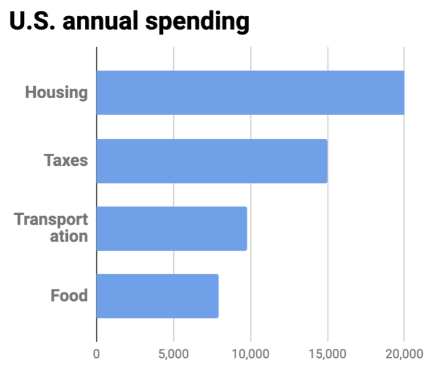

A great life is exciting, not expensive. (Source: [Derek Owens](https://unsplash.com/@derekowensheart?utm_source=unsplash&utm_medium=referral&utm_content=creditCopyText).)

## Forget coupons—use this big-picture view of saving money, that's actually fun

Most money-saving advice focuses on minor tweaks. Eat out less, skip that latte, cut your own hair. 

That's all well and good. After all, **a penny saved is a penny earned—but it's still just a penny.**

Sure, you'll save a few dollars on coffee, but you'll save more—and reach your financial freedom faster—by going after the "big fish." After all, $1,000 saved is $1,000 earned.

Look at the following chart:

The four largest expenses are housing, taxes, transportation, and food.

Above, you see the biggest expenses are [housing](https://adam-costa.com/financial-freedom/reduce-expenses/housing/), [taxes](https://adam-costa.com/financial-freedom/reduce-expenses/taxes/), [transportation](https://adam-costa.com/financial-freedom/reduce-expenses/transportation/), and food. These are the "big fish." 

Start with the largest expense—housing—because it provides the best return. For example, let's say you spend $20,000 a year on housing; if you [reduce your housing expenses](https://adam-costa.com/financial-freedom/reduce-expenses/housing/) by 10%, you'll save $2,000 a year. That's a lot.

If, on the other hand, you reduce your spending on food (currently $8,000, according to the chart above) by 10%, you'll only save $800. Not bad by any measure—but a far cry from $2,000.

That's not to say you can't reduce spending across *all* categories. You certainly can. But focus on the big opportunities first, then work your way down the list. $2,000 saved is $2,000 earned.

Now that we've identified the top three categories—housing, taxes, and transportation—let's look at several conventional, and unconventional, ways to reduce your expenses. You won't get the same tired advice about skipping lattes or clipping coupons. Rather, **these strategies will help you get fit, travel more, and live an exciting life**—all while slashing your expenses by 20–50%.

We'll focus on the big three:

- [Housing](https://adam-costa.com/financial-freedom/reduce-expenses/housing/)
- [Taxes](https://adam-costa.com/financial-freedom/reduce-expenses/taxes/)
- [Transportation](https://adam-costa.com/financial-freedom/reduce-expenses/transportation/)

Click the links above to learn more.