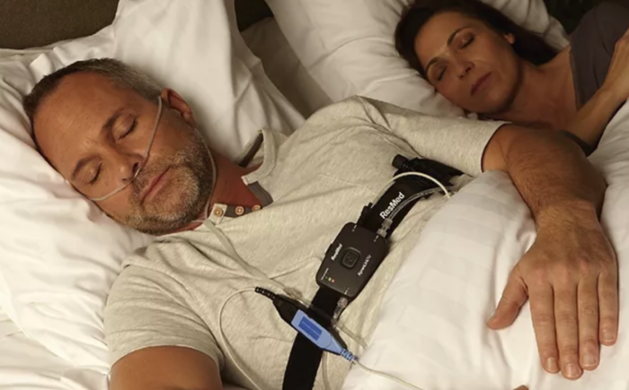
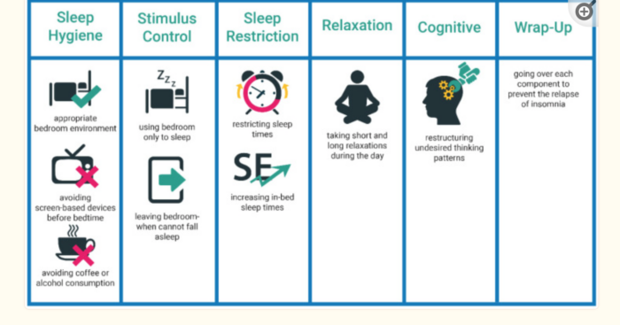

My quest to end insomnia, once-and-for-all

I'm not older; I'm just a newer version of me.

For decades, I have been a terrible sleeper. 

Back in college, however, my lack-of-sleep felt like an advantage. I could go to school in the evenings, hang out with friends until 2am, crash for three hours, and feel fine stocking freezers at 5:30am. 

Then again, most things are easier in your 20s. 

But over time, I found sleep harder and harder to come by. Worse still, there didn't seem to be one type of sleep disorder. Some nights I couldn't go to sleep; other nights I'd crash out instantly, only to wake up in the middle of the night; still other nights I'd wake up 2-3 hours early. In all cases, I'd go to bed wondering just when the hell I was going to wake up.

Then, in my early thirties, I started waking up gasping for air. It was a terrible feeling—so bad in fact, that I'd often jump out of bed just to try and get air. I don't wish to sound melodramatic, but it felt like dying.

So, after twenty years of poor sleep, I've decided to solve this problem once and for all. 

Here's what I've learned.

## 

## Sleep study results

After two months of extremely bad sleep, I'd had enough. So I signed up for a sleep study to help me understand two things: first, what was causing my sleep issues; and second, what the hell could I do about it.

Sleep studies come in two flavors: shitty and shittier. Sorry, I meant at-home and on-site. After speaking with several people who'd tried one or the other, I've yet to find anyone who enjoyed either experience. 

Having said that, it's not the experience that matters. Unlike massages—which are enjoyable and provide ongoing benefits—a sleep study helps you diagnose what the hell's going on with your body when you're trying to sleep (or already asleep). So while the study sucks, the insights are (hopefully) worth it.

Here's my experience with a sleep study:

I went to the sleep center and picked up the the sleep test machine. Then, before bed you hook this contraption to your face. 

Sexy, right?

OK, so it's not as bad as an Iron Maiden—but it still ain't fun. You've got tape over your face, tubes in your nose, and what feels like a defibrillator strapped to your chest.

Once you're strapped in, you don't have to do anything else. Besides go to sleep, of course.

The doctor mentioned that, ideally, I'd sleep for 6–8 hours to get them enough data. When I replied that if I was able to sleep that long—especially with a small machine attached to my chest—then I wouldn't be requesting sleep study in the first place. To which he replied, "Eh, four hours will be enough."

OK.

So I tried. And, of course, I couldn't sleep. So I spent 12 hours wandering around the house with this contraption hooked up to me. I slept for two hours, then was up for six, then finally just barely got another two hours in. Whew.

The following morning I dropped off the machine and waited for the results. (You can expect this to take 2–3 weeks.)

<insert experience>

## Cognitive-behavioral therapy for insomnia (CBTi)

This was a game-changer. While it does include the basics you find online—avoid caffeine and alcohol, no electronics 2 hours before bed, meditation—CBTi takes it several steps further. 

In a nutshell, here's what it looks like:

[Source](https://www.ncbi.nlm.nih.gov/pmc/articles/PMC7999422/).

Looking at the image above, we see there is a LOT to work on. You start with sleep hygiene education, stimulus-control, sleep restriction, relaxation training, and then move on to cognitive therapy.

While I'm a fan of quick fixes, bigger problems often require a multi-pronged approach. (Think Hercules and the Hydra.) So I gave it a shot.

Let's look at each.

## Sleep hygiene education

In several studies, people were 

## Stimulus control

## Sleep restriction

## Relaxation training

## Cognitive therapy

From the article (image above): 

Cognitive Therapy: Cognitive therapy is focused on recognizing and altering dysfunctional thoughts and negative thinking patterns about sleep, for instance, worrying [3]. Then a set of methods are applied to overcome undesired sleep-related thoughts and unrealistic worries. The three common methods are cognitive restructuring, paradoxical intention, and thought stopping [3]

## Constructive worrying (?)

## Sleep supplements

As long-term readers may recall, I took a nutrition course and posted my learnings [here](http://nutrition). The course recommended several supplements for sleep that I'd never heard of. While I'm not a pill popper, I figured it was worth trying. 

**Zinc-magnesium complex**. Years ago, my wife and I once house sat for a wealthy couple in England. 

**Phosphatidylserine** is a great sleep aid. It's a phospholipid that protects your brain cells and helps relay messages between them. As we age, our levels decrease, which can lead to memory issues and poor sleep. It also lowers cortisol levels, which makes it especially useful for people looking to reduce stress. It has ben shown to reduce exercise-induced stress. 

The first time I took this stuff, I passed out. *Hard*. And it helped me sleep through the night. As a downside, however, I woke up groggy. Usually I am one chipper chipmunk in the morning—so this came as a surprise.

But, like so many things we put in our bodies, the impact lessened somewhat with time. I cycle usage now: a standard dose for a few days, then off for a week. 

## Breathing exercises

### The Body Oxygen Level Test (B.O..L.T.)

Described in the book The Oxygen Advantage, your BOLT score shows how long you can comfortably hold your breath. 

To test yourself, do the following:

- Breathe in normally
- Breathe out normally
- Hold your breath (you can pinch your nose if this helps)
- When you truly need to inhale, measure how many seconds passed

Most people will only be able to do ~20 seconds at first. (I could do only five!). You should be able to go a minimum of 25 seconds, with 30–40 being ideal. 

So... what's the point? Who cares if you can hold your breath 10, 20, or 40 seconds? 

Here's why it matters: The B.O.L.T. test measures how well you can handle an increase in carbon dioxide (CO2). While most of us were taught that CO2 is essentially a waste product of breathing—something to be expelled as quickly as possible—it actually is quite useful. According to [an article](https://www.ncbi.nlm.nih.gov/books/NBK482456/#:~:text=CO2%20is%20transported%20in%20the,hemoglobin%20for%20oxygen%20(O2).) in the National Library of Medicine, CO2  regulates of blood pH, respiratory drive, and affinity of hemoglobin for oxygen (O2). 

In other words, CO2 tells our body to absorb and use oxygen. Without CO2, our bodies wouldn't use oxygen and we'd eventually die.

McKeown argues that we must increase our tolerance to CO2 to fully realize good health. He goes on to say that most people have plenty of oxygen; it's the chronic levels of low CO2 that's the problem. And that's what the BOLT score measures. 

Increasing your BOLT score means you are able to handle normal levels of CO2. A low BOLT score—like my pathetic 5 seconds—shows that you have a low tolerance to CO2 levels. So low, in fact, that even a normal amount of CO2 feels like too much. 

This creates a vicious cycle: as your CO2 tolerance decreases, you instinctively over-breathe, which further reduces your CO2 tolerance. And so on.

In addition to CO2, holding your breath also increases the amount of nitric oxide in your nose. When you inhale, the nitric oxide enters your bloodstream. Like CO2, nitric oxide helps with vasodilation (meaning it increases your capillaries), blood flow, and deliver oxygen to tissues throughout the body.

The benefits are huge:

- Reduced heart rate
- Greater oxygen uptake into muscles
- Reduced stress
- Improved metabolism
- Reduced appetite

Aim for 6 breaths per minute. (Most people do twice this amount.) By reducing the quantity of breaths, you increase the quality.  So that's about ten seconds for each breath. Ideally you'll inhale for 4 seconds, exhale for 5, and hold your breath for a second before inhaling again.

Frankly, this sounds simple—but I really, really struggled with this. After doing the BOLT score test every day (2–3 minutes per day) you should improve your BOLT score by 10–15 seconds within six weeks.

This exercise is fantastic to do right before bed. While improving your CO2 tolerance, you'll also calm down before bed. 

**Pro tip:** do the BOLT score test for 3 minutes before bed. It really works!

## Summary of what I tried, with results

### Most effective

Sleep compression.  I never appreciated how stressful it is to lie in bed awake. By scheduling my bedtime later, I got the same amount of sleep in about half the time. Sleep efficiency for the win!

Sleep masks

BOLT score test.

Cutting out alcohol

Sleeping on my side (or stomach, though my chiropractor says this is really bad for my neck)

Sleep hygiene (no light, no electronics, dark, cool environment)

### Somewhat effective

Magnesium

Phosphytidlserie

Cutting out caffeine

White noise (e.g. fans)

### Least effective