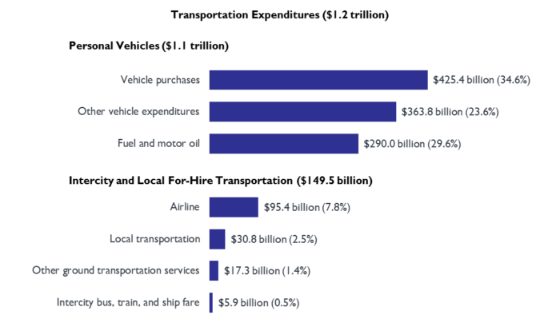
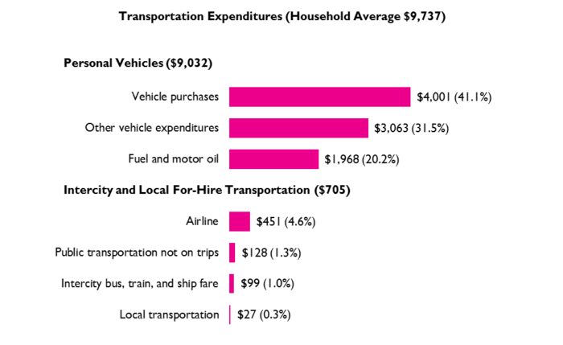

Top transportation expenses. (Source: Bureau of Transportation Statistics)

## Reduce your transportation costs with these simple tips

Transportation is one of the top three expenses most people have—so it pays to reduce it.

But I'll be honest with you: I didn't want to write this section. It felt... *preachy*. After all, you're an adult; you don't need me preaching useless platitudes like "drive less and walk more!". 

(Yeah, and while we're on the subject: eat right, sleep more, and floss. You're welcome.)

You see, when it comes to advice on transportation, there are two problems.

The **first** problem is that most advice is painfully obvious. Everyone knows that walking more will saves money, improves health, and makes you look better naked. 

The **second** problem is that, despite being obvious, people still don't follow them. Most people will *still* drive a few blocks (or even across a strip mall parking lot) rather than walk. They'll take the health hit and look terrible naked.

Of course, just because something is obvious doesn't make it bad advice. And just because people don't follow that advice, doesn't make it ineffective. 

So, this section will only focus on two transportation costs: cars and planes. I'll keep in brief, and show you how a few simple tweaks can save you $70,000 over ten years (and more if you really dig traveling). It's a quick, easy shortcut to [financial freedom](https://adam-costa.com/financial-freedom/).

And no, you don't have to walk.

## How to reduce—or eliminate—your transportation costs

The simplest answer is to:

- **[Work remotely](https://adam-costa.com/financial-freedom-page/how-to-increase-your-income/work-remotely/)**. By working remotely, you eliminate your daily commute. And if you eliminate your commute, you may be able to...
- **Get rid of your car** (or share one with your roommate or partner). My wife and I work remotely and have shared a car for the past ten years. If she needs the car I'm happy to...
- **Walk, run, or ride a bike. **Travel for free, enjoy time outside, and get the benefits of exercise? This is a no-brainer. Of course, if it's freezing outside you could always...
- **Take a taxi (or Uber, or Lyft, or whatever)**. Or... *gasp!*... the bus. And when wheels won't work...
- **Use points to fly free.** With a few simple steps, you can fly anywhere in the world, several times a year, for free. 

It really is that simple. Really. But since the devil's in the details, let's break down the biggest opportunities. 

According to the Bureau of Transportation Statistics, here's what people in the US spend on transportation:

Top transportation expenses. (Source: Bureau of Transportation Statistics)

"Vehicle purchases" is self-explanatory. 

“Other vehicle expenditures” include vehicle insurance, vehicle parts, and maintenance and repair costs. For some strange reason, "fuel and motor oil" are considered separate from general maintenance. 

Put another way: we spend money buying cars, maintaining them, and pumping them full of petrol.

Besides cars, the next biggest expense is buying airline tickets. While the total expense is significantly lower than car-related expenses, we'll also focus on flights because, frankly, **you shouldn't be paying for flights at all**. While you can cut your car expenses by 25–50%, I can almost guarantee you can eliminate your flight expenses.

## The car's devastating effects on humanity (and your financial freedom)

Consider the car. Viewed, by many, as essential to modern life. Cherished by some; loathed by a vocal few; used by nearly everyone. 

The car's devastating effects on humanity cannot be understated. For example, did you know that:

- Nearly 95% of a car's life is spent parked.
- In most cars, the "new car smell" is toxic. It contains over 50 volatile organic compounds.
- Every 45 seconds, a car is stolen in the United States.
- The average person spends roughly 5 months of their life sitting at red lights.
- U.S. traffic costs over $160 billion a year, including wear and tear on vehicles, gas burned while idling, and lost productivity.
- Los Angeles has more cars than people.
- Each year, the average driver wastes over 42 hours a year stuck in traffic. (In 1982, the average was 16 hours.)
- People who take  public transit systems are, on average, 5 pounds lighter than people who drive.
- Car crashes are the 9th leading cause of death—and account for 2.2% of all deaths globally.
- Each year in the US, over 37,000 people are killed in road crashes, with an additional 2.35 million injured or disabled.
- Roughly one million animals are killed on U.S. roadways every day.

Cars sit idly, burn money, dirty your air—and may ultimately kill you.

May I suggest downplaying your use of cars? If you're curious as to how, read on.

Let's review three ways to reduce car expenses: eliminate a car, use the car less, and buy a cheaper car.

### Sell your car to some other schmuck—and enjoy the freedom that comes with it

My wife and I've shared a car for ten years. A quick look at the Bureau of Labor Statistics (see below) shows the average person spends $4,001 on a new car, and about $5,000 for fuel and other vehicle expenditures. 

How much money the average household spends on transportation. 

How much have we saved by not buying a second car? Let's do the math. First, we saved $4,000 by NOT buying a car in the first place, plus an additional $5,000 a year for 10 years.

By my count, that's $54,000. Invested conservatively and earning 5% interest per year, that number grows to $69,405—or the average household annual income. By sharing a car, the average couple will literally enjoy one free year of savings!

While sharing a car works for us, it may not work for you. You may have commutes in opposite directions, or you're into hardcore mechanophilia. Whatever.

But even if you need your very own car—and that's totally fine if you do—you can benefit greatly from driving less. For example, if you drive just *half* what the average person does, you'll save $2,500 a year, or $25,000 over a decade. 

Remember: based on the 4% rule, every dollar you don't spend is $25 you don't have to make. So saving that $2,500 a year reduces your total investments needed by $62,500. 

OK, enough about cars. Let's discuss the fun stuff: flying around the world, for free.

## Fly for free—forever

If you live in the United States and have decent credit, you should never pay for flights. 

Rather than pay for flights—I still shudder at the thought—sign up frequent flyer programs and credit cards that provide rewards "points" for every dollar you spend. (Most credit cards include a bonus if you spend a certain amount in the first three months.)

When it comes to flying for free, there are two schools of thought:

1. Mile maximizers: those who review current credit card deals, browse frequent flyer forums like flyertalk.com, and spend hours plotting routes to—you guessed it—maximize the value of their miles.
2. Lazy people: those who sign up for a few credit cards, get the bonus miles, set the bills up on autopay—and never look at it again.

I'm lazy. So, if you're new to the rewards game, simply follow along and you'll be fine. If you want to delve deeper down the rabbit hole, that's cool: I'll include resources at the end.

### Keep it simple: use Chase cards first

Start with credit cards from Chase. They're your best bet to start with for four reasons. 

First, they offer some of the best points to dollars ratio.

Second, Chase's Ultimate Rewards Points—their fancy term for "miles"— aren't specific to a certain airline/alliance. So you can just as easily use them on flights with American, United, or Delta.

Third, you can combine all the rewards points from various Chase cards into a single rewards account. (Pro tip: make sure you put all your points into your Chase Sapphire Preferred account, since you get a 25% higher redemption value.) 

Lastly, the Chase flight interface is super simple to use. And since you're not tied to a particular airline, you're free to view all possible flights available—all from one easy interface.

Below, you'll find a list of the three credit cards for travel. It's by no means exhaustive (I told you, I like to keep things simple). Rather, these are solid cards that have been around for years, and specifically benefit people interested in travel. You're free to research other cards as well, but I suggest you start with these three. 

In doing so you'll get well over 150,000 bonus points—which you can redeem for 7 or 8 one-way domestic flights or 3–4 international flights. And that's not including the ongoing points you'll accrue from actually using the credit cards. 

#### Chase Sapphire Preferred

Everyone should start with this card (or its more expensive partner, the Sapphire Reserve).

- Sign-up bonus: Earn 60,000 bonus points after you spend $4,000 on purchases in the first 3 months.
- Earn 2X points on travel and dining.
- 1 point per $1 on all other purchases.
- Get 25% more value when you redeem for airfare, hotels, car rentals and cruises through Chase Ultimate Rewards. 
- $95 annual fee.

#### Chase Ink Business Preferred

This card is ideal if you run your own business. It's especially valuable if you spend money advertising online (because you get 3 points for every $1 spent, which is huge).

- Sign-up bonus: Earn 80,000 bonus points after you spend $5,000 on purchases in the first 3 months.
- Earn 3 points per $1 on the first $150,000 spent in combined purchases on travel, shipping purchases, Internet, cable and phone services, and on advertising purchases made with social media sites and search engines each year.
- 1 point per $1 on all other purchases.
- Points are worth 25% more when you redeem for travel through Chase Ultimate Rewards.
- $95 annual fee.

#### AmEx Gold

The AmEx Gold card is perfect if you spend a lot of money at supermarkets and restaurants. The annual fee's higher than most, but you'll easily get 3–5x that in return with travel and dining credits.

- Sign-up bonus: Earn 50,000 bonus points after you spend $2,000 on purchases in the first 3 months.
- Earn 4 points per $1 at U.S. supermarkets and restaurants worldwide.
- Earn 3 points on flights booked directly with airlines or on amextravel.com.
- 1 point per $1 on all other purchases.
- $120 dining credit at select restaurants.
- $100 airline credit (good for baggage fees or in-flight meals).
- $250 annual fee.

### Sign up, and claim your bonus points

Sign up for one, hit the minimum spend requirements and wait for the points to hit your account. It usually takes a few months—so don't delay.

A few additional points:

1. Some cards give you extra miles if you co-sign your significant other. Do this. It's practically free money.
2. Don't hoard your points. Unlike money, which can be invested and earn a rate of return, the value of your points will decline over time as companies raise reward requirements. Therefore, spend points early and often.
3. I *highly* recommend booking your flights asap. Rewards tickets can be booked up to a year in advance.