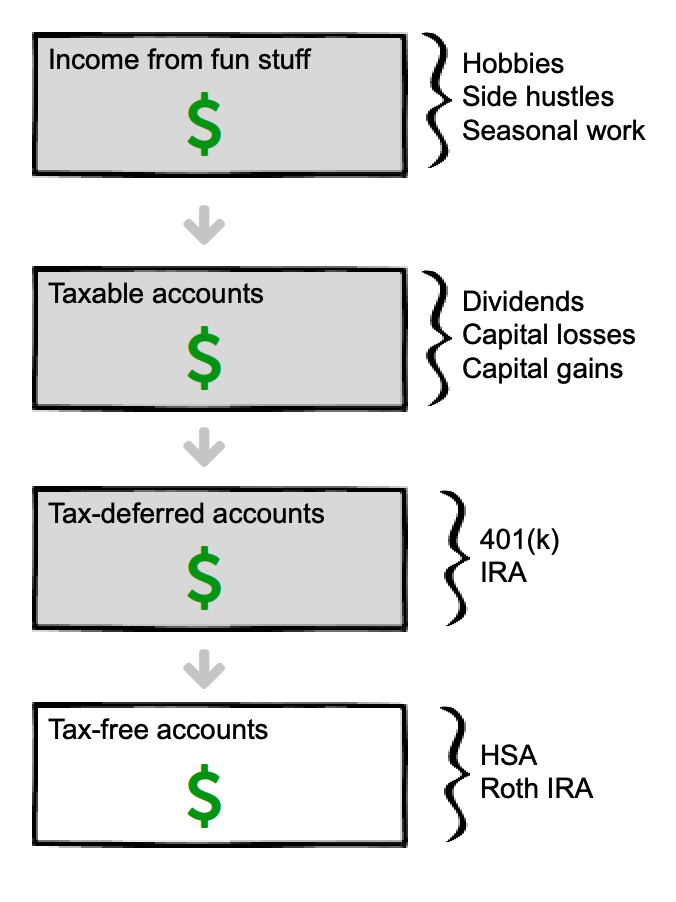
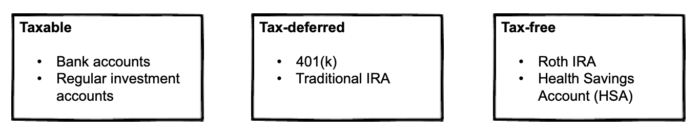
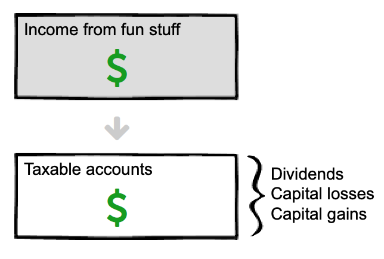
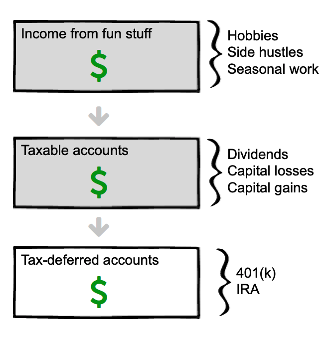

This represents the order you should withdraw your money to reduce your tax-burden. Keep reading for details on each step.

## A simple way to live off your investments, optimized for taxes

**Picture it: **

After years of saving and investing wisely, you're now ready to start pulling an income from your big 'ole pile-o-cash.

But how? 

Should you:

- Pull it from your retirement or taxable account?
- Sell your worst-performing investments first, to claim the capital loss—and therefore reduce capital gains—on your tax return? 
- Or sell your best-performing investments to reap the benefits, and passively reallocate?

The answer is: it depends.

Keep reading to discover which approach is right for you.

## The three buckets

As you build wealth, they will be in up to three buckets:

- Taxable
- Tax-deferred
- Tax-free

Each bucket may include multiple accounts. For example, you may have collected several 401(k) accounts from various employers; while they are several accounts, they all belong in the same bucket (in this case, the tax-deferred bucket).

Here's a quick visual:

The three buckets. Each bucket may include multiple accounts.

Now that we've covered the basics, let's talk about the fun stuff: spending your money.

## First, spend your "fun money"

Let's say that you make money from an enjoyable hobby or part-time job. Spend that money first. 

Spend any money earned from fun projects first!

## Second, spend money from your taxable account(s)

Spend this money next. Remember that you may have several accounts in this taxable "bucket".

And to further complicate things, there are different ways of accessing money from the same account.

For example, you can access:

- Dividends from taxable account. You can set these up to be automatically deposited into your bank account if you wish. (Up until now, you should have automatically reinvested the dividends to fuel future growth.)
- Capital losses (i.e. sell stuff that lost value).
- Capital gains (i.e. sell assets that appreciated).

**Withdraw your dividends first.** This money has already been taxed, so you may as well spend it.

Next, sell shares of your investments. Depending on market performance—and perhaps your overall strategy, see the "Other strategies" section further down the page—you'll sell your shares for either a profit or loss. Either way, pull it out.

Withdraw dividends from your taxable account first, then capital losses and gains.

## Third, spend money from your tax-deferred account(s)

There are a few considerations:

- You *will* pay a penalty fee for an early withdrawal. For a Traditional IRA or 401(k) there is a 10% penalty fee if you withdraw before 59.5 years old. 
- You *may* also pay income tax on top of the 10% penalty. Or not. (More on this in the [conversion section](#convert-tax-deferred-income) below.)

Next, pull money from tax-deferred accounts. Beware of early withdrawal penalties and income tax!

## Fourth, spend money from your tax-free account(s)

Your tax-free accounts should only be touched last. Since you'll never pay taxes on these accounts—unlike all other accounts on this list—it makes sense to let these grow for as long as possible. 

The most common tax-free accounts are a Roth IRA and Health Savings Account (HSA). 

- If you *do* have medical expenses that you've paid for out-of-pocket (in the current or any previous year), then pull money from your HSA first.
- If you *don't* have medical expenses, pull the money from your Roth account first.

If you have medical expenses, pull money from your Health Savings Account (HSA). If not, pull it from your Roth.

The above strategy is pretty straightforward. To summarize:

- Each month (or year), spend your "fun money" first. This includes money-making hobbies, seasonal work, or new businesses.
- Then spend the dividends from your taxable account. Since it's already been taxed, it makes sense to spend it.
- Then spend your money from your tax-deferred accounts.
- Last, tap into your tax-free money.

That's it in a nutshell. However, your strategy may change based on your specific situation. Let's look at a few different strategies.

## An example—plus, other strategies you may consider

Meet Rasputin.

Rasputin has $1 million invested. Based on the [4% rule](https://adam-costa.com/financial-freedom/strategy/freedom-aint-free-so-how-much-does-it-cost-4-rule-explained/), he can safely pull $40,000 a year.

Here is how Rasputin's money is spread about:

| **Taxable** | **Tax-deferred** | **Tax-free** |
| $450,000 | $450,000 | $100,000 |

Based on the magnificent strategy we've reviewed thus far, Rasputin would pull from his taxable account first. 

So, in year 1, he pulls $40,000 from his taxable account, and lets everything else ride.

Same for year 2, 3, and so on—until the taxable account is depleted. 

"How long will that be?" you ask.

Well, it'd be reasonable to guess 11 years. After all, $450,000/40,000 = 11.25.

But during those 11 years, remember, Rasputin's investments are growing. Let's say they grow at 5% each year, adjusted for inflation. 

At that rate, the money won't last 11 years—it'll last close to 17.

And here's the best part: during those 17 years, his other accounts—the tax-deferred and tax-free accounts—will continue to grow.

Remember, Rasputin's got another $550k invested, which, over 17 years at a 5% growth rate above inflation, grows to...

**$1,260,610.**

After 17 years of joyful living—and not earning a dime from hobbies, inheritances, or Social Security—Rasputin has not only NOT run out of money... he is now 20% richer than when he started! 

(Here's the calculation: [$550,000*(1.05^17)](https://www.google.com/search?q=550%2C000*1.05%5E17). (In words, this means "$550,000 times 5% annual growth to the power of 17".)

"But wait a minute!" you say. "Rasputin's still gotta pay income tax on that! Plus the 10% early withdrawal fee."

You're right. But does it matter? After all, Rasputin's enjoyed 17 glorious years of doing whatever-the-hell he wants, and now, after 17 YEARS, the "gotcha" is that he has to the small penalty and some taxes. 

As it stands currently, he'll owe about 8% tax AND the 10% early withdrawal penalty on the $40,000. 

After taxes and the penalty, the $40,000 turns into $32,800.  

Ouch.

OK, so maybe it *does* matter. But it's not as bad as it looks. Remember: the 10% penalty disappears once you are 59.5 years old.

In Rasputin's case, he started withdrawing money from taxable account at age 40; after 17 years, the account is depleted. So Rasputin, now age 57, sucks it up and pays the penalty—of roughly $4,000 a year—for only 2.5 years. 

Not ideal, but doable. And remember: there are ways to completely avoid the penalty. It also doesn't factor in:

- Pulling extra money from a fun hobby at some point over the past 17 *years*. 
- Pulling money from his tax-free account (remember, Rasputin has $100,000 invested in this account, too, which can be pulled during these years to eliminate  the penalty).
- Getting an inheritance or other windfall.

But if you really want to avoid the penalty, there are other ways to do it. Keep reading to find out.

## Avoid early withdrawal penalties on tax-deferred accounts

We've already covered waiting until you are 59.5. That's the easy option.

But there are a few *other* ways to avoid early withdrawal penalties on tax-deferred accounts. Most aren't pleasant—such as divorce, disability, and dying—but here they are:

- Wait until you are 59.5 (this is one we're counting on!)
- First-time home purchase
- Qualified education expenses
- Unreimbursed medical expenses
- Divorce
- Permanent disability
- Call of duty (i.e. going to war)
- Dying

There are others, too. You can see the full list on the [IRS site](https://www.irs.gov/retirement-plans/plan-participant-employee/retirement-topics-tax-on-early-distributions).

In Rasputin's case, he didn't get divorced, disabled, or dead. Therefore, he has to pay the 10% withdrawal penalty until he turns 59.5 years old, or pull money from his tax--free account for 2.5 years until he hits 59.5. Either way works.

Up until now, we've covered the early withdrawal penalty. But taxes are much more important. Let's review that now.

## Reduce income tax on tax-deferred accounts

Now for the fun stuff. 

When you decide to pull money from tax-deferred accounts, you're probably not making much, or any, income. After all, you wouldn't pull money from a retirement account if your income covered your expenses, right? 

So you aren't making money from a job—which turns out to be a good thing because when your income goes down, you will likely enter a lower tax bracket. In other words, when you live off your bank instead of your back you pay less tax. Which is nice.

Here's an example:

Rasputin made $100,000 a year at his job. So, at the federal level, his effective tax rate is 15%. But once he starts pulling money from his retirement account, his income drops to only $40,000—which reduces his effective tax rate to only ~8%. Thus, without lifting a finger, Rasputin has cut his effective tax rate almost in half. 

(Note: tax rates change all the time. So while these numbers will be close, check the current tax brackets to confirm the exact numbers.)

### Another cool way to reduce taxes: move to a tax-friendly state

This guide focuses on federal taxes—and ignores state taxes—because (i) federal taxes are usually a larger chunk and (ii) state tax rates vary widely. 

If you don't already live in a tax-friendly state, consider moving to one. According to SmartAssets.com the most tax-friendly states either have no state income tax, no tax on retirement income, or a significant tax deduction on retirement income. In addition, states in this category have friendly sales, property, estate and inheritance tax rates.

Here are the most tax-friendly states for retirees:

-   Alaska
-   Florida
-   Georgia
-   Mississippi
-   Nevada
-   South Dakota
-   Wyoming

... and here are the least tax-friendly:

-   California
-   Connecticut
-   Maine
-   Minnesota
-   Nebraska
-   Rhode Island
-   Vermont

You can see a full, updated list [here](https://smartasset.com/retirement/retirement-taxes).

**Key point: **moving to a tax-friendly state will save you a little money when retired, but it will save you a lot more money if you're still working. Consider moving early for taxes, then live wherever the hell you want when retired. You've earned it.

## Reduce (or avoid) capital gains tax on taxable accounts

You can reduce—and even eliminate—capital gains tax on your taxable account with a little foresight and a few simple clicks. To do this, you need to:

- Keep your taxable income below the *standard deduction *(which shouldn't be hard... but if it is, that's a good problem to have!).
- Withdraw only enough from taxable investments to stay in the 0% tax bracket for capital gains.

With this strategy, the standard deduction is your friend because it's tax-free money. And more importantly, it helps you stay in a low enough tax-bracket to pay zero tax on your capital gains.

You see, according to the IRS there are two types of income: *regular income* and *capital gains*.

- *Regular income* comes for your job, dividends, and profits from assets held for less than one year.
- *Capital gains* come from profits on assets—such as stocks—held for more than one year. (Assets held for less than one year are called short-term capital gains and taxed as regular income.)

**Key point:** regular income is usually taxed at a much higher rate than long-term capital gains. 

For example, Rasputin doesn't have income from fun stuff. But he *does* have income from dividends, which is considered regular income and taxed accordingly. 

## Convert tax-deferred income to tax-free income

OK, so you've got the tax-deferred bucket, which you'd think means you need to pay the tax-man at some point. But there are simple strategies you can use to convert tax-deferred income to tax-free income using a *Roth conversion*. 

A Roth conversion moves money from a Traditional IRA to a Roth IRA. Sure, you pay the penalty and tax today, but that money then grows tax-free for *decades*—and is withdrawn tax-free, too! 

## How often should you withdraw?

Whenever you want.

Seriously. It's that easy. 

But if you really want to optimize things—and juice your returns—it's better to withdraw smaller amounts more frequently than one lump sum. Withdrawing money monthly gives the rest of your investment more time in the market—which, more often than not, continues to grow. 

You can set up your investments such that they automatically deposit funds into your checking account every month. That's the best of both worlds: you leave your money in the market, and you don't lift a finger to withdraw the money. All this happens on autopilot. (Slight aside: if you haven't already, read this [guide to automating your investments](https://adam-costa.com/financial-freedom/automate-scale-your-investments/build-wealth-automatically/).)

Recommended reading: [asset allocation](https://adam-costa.com/financial-freedom/automate-scale-your-investments/asset-allocation/), [investment order](https://adam-costa.com/financial-freedom/automate-scale-your-investments/investment-order/).